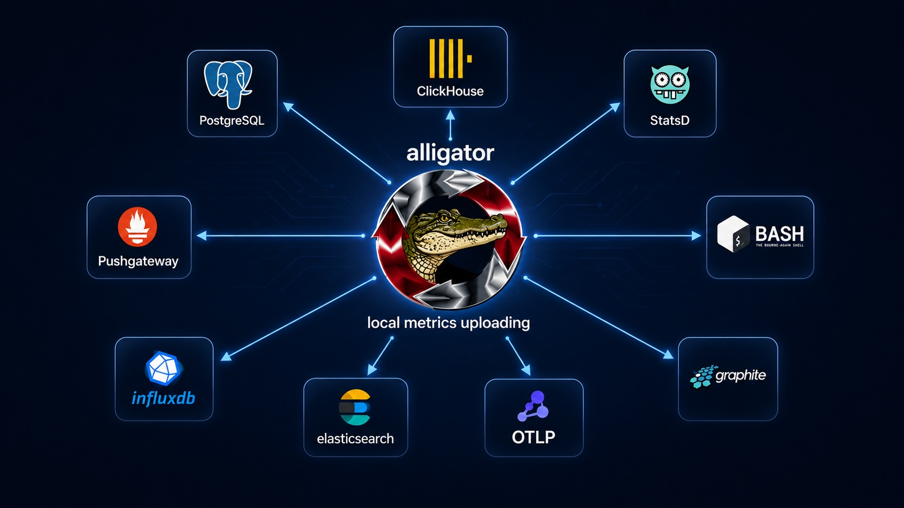

**Language / Язык:** [English](../action.md) | [Русский](action.md)

# Action

Этот модуль позволяет выполнять команды и экспортировать метрики во внешние базы данных и скрипты.\
Action может запускаться по поведению метрик или по расписанию.\
Этот контекст можно использовать несколько раз в конфигурации.

<br>
<p align="center">
<h1 align="center" style="border-bottom: none">
    </a><br>
</h1>
<br>
<br>
</p>


## Обзор

```
action {
    name <name>;
    expr <epression or url>;
    ns <namespace>;
    work_dir <working directory>;
    serializer <serializer>;
    add_label <key:value>;
    follow_redirects <redirects>;
    engine <engine>;
    index_template <index_template>;
}
```

## name
Задаёт имя контекста. Его можно использовать как ссылку для других контекстов (например, query или scheduler) или в API.


## expr
Выражение, задающее команду для выполнения или URL.

При запуске action (например, из scheduler или query) **`expr` должен быть непустым**. Если он отсутствует или пуст, Alligator пишет в лог на уровне fatal и пропускает выполнение этого action (без аварийного завершения процесса).

Несколько scheduler могут ссылаться на один и тот же action. Ключ агрегатора каждого запуска включает имя scheduler, поэтому пересекающиеся тики от **разных** scheduler не блокируют друг друга. Пересекающиеся тики от **одного и того же** scheduler используют один ключ и не выполняются параллельно.

Пример запуска nginx, если порт не слушается:
```
query {
    expr 'count by (src_port, process) (socket_stat{process="nginx", src_port="80"}) == 0';
    make nginx_exists;
    datasource internal;
    action no_nginx;

}
action {
    name no_nginx;
    expr 'exec://systemctl start nginx';
}
```

Другой пример: периодический запуск скрипта с передачей сериализованных метрик в формате JSON в stdin скрипта:
```
scheduler {
  name sched-script;
  period 15s;
  datasource internal;
  action run-script;
}

action {
  name run-script;
  serializer json;
  expr /usr/bin/script.sh;
}
```

## ns
Если у базы данных есть внутренние пространства имён (например, базы в реляционной СУБД), это поле задаёт имя такого пространства.


## dry\_run
Режим dry-run помогает подобрать способ работы с вашими командами и запросами без их фактического выполнения.


## work\_dir
Задаёт рабочий каталог для запуска внешнего ПО из командной строки.


## serializer
Задаёт сериализатор для выходных данных. Тело выхода должно быть согласовано с источником входных данных.
Доступные сериализаторы:
- json
- dsv
- graphite
- statsd
- dogstatsd
- carbon2
- influxdb
- clickhouse
- postgresql
- cassandra
- elasticsearch
- dynatrace
- openmetrics
- otlp
- otlp\_protobuf

При простом HTTP-запросе тело передаётся в теле HTTP POST.
Эта опция также задаёт коннектор базы данных, который будет использоваться для подключения.

Реализация OTLP поддерживает только HTTP-протокол с кодировкой json и protobuf.


Например, следующий скрипт будет периодически отправлять все метрики в pushgateway и statsd:
```
scheduler {
  name sched-graphite;
  period 5s;
  datasource internal;
  action to-graphite;
}

action {
  name to-graphite;
  serializer graphite;
  expr udp://localhost:1112;
}

scheduler {
  name sched-pushgateway;
  period 15s;
  datasource internal;
  action to-pushgateway;
}

action {
  name to-pushgateway;
  serializer openmetrics;
  expr tcp://localhost:9091/metrics;
}

scheduler {
  name sched-statsd;
  period 5s;
  datasource internal;
  action to-statsd;
}

action {
  name to-statsd;
  serializer statsd;
  expr udp://localhost:1112;
}

scheduler {
  name sched-dogstatsd;
  period 5s;
  datasource internal;
  action to-dogstatsd;
}

action {
  name to-dogstatsd;
  serializer dogstatsd;
  expr udp://localhost:1113;
}

scheduler {
  name sched-dynatrace;
  period 15s;
  datasource internal;
  action to-dynatrace;
}

action {
  name to-dynatrace;
  serializer dynatrace;
  expr http://localhost:14499/metrics/ingest;
}

scheduler {
  name sched-otlp;
  period 15s;
  datasource internal;
  action to-otlp;
}

action {
  name to-otlp;
  serializer otlp_protobuf;
  expr http://localhost:4318/v1/metrics;
}
```

## follow\_redirects
Задаёт максимальное число редиректов при HTTP-запросах. Значение по умолчанию — ноль, то есть редиректы не следуются.


## engine
Позволяет задать движок для создания таблиц в Clickhouse.

```
action {
    name to-clickhouse;
    expr http://localhost:8123;
    serializer clickhouse;
    engine ENGINE=MergeTree ORDER BY timestamp;
}
```

## index\_template
Позволяет задать имя индекса для ElasticSearch с помощью шаблона. Эта опция поддерживает форматирование strftime, что даёт динамически изменяемые значения во время выполнения.\
Пример использования приведён ниже:

```
action {
    name to-elastic;
    expr http://localhost:9200/_bulk;
    serializer elasticsearch;
    index_template alligator-%Y-%m-%d;
}
```


## metric_name_transform_pattern

`metric_name_transform_pattern` и `metric_name_transform_replacement` задают правила преобразования имён метрик перед экспортом через action.

- `metric_name_transform_pattern`: регулярное выражение (синтаксис PCRE), сопоставляемое с именами метрик. Используется для выделения всего имени или его части, которую нужно переписать или нормализовать. В каждом имени используется только **первое** совпадение.

- `metric_name_transform_replacement`: строка замены для переименования метрик. Можно использовать `$1`, `$2`, ... для подстановки текста из соответствующих захватывающих групп в `metric_name_transform_pattern`.

**Пример:**
```
action {
  name to-elastic;
  expr http://localhost:9200/_bulk;
  serializer elasticsearch;
  metric_name_transform_pattern ^stats\.(.*)$;
  metric_name_transform_replacement custom.$1;
}
```
В этом примере любое имя метрики, начинающееся с `stats.`, будет переписано так, чтобы начинаться с `custom.` (например, `stats.http.requests` → `custom.http.requests`).

**Примечания:**
- Если `metric_name_transform_pattern` и `metric_name_transform_replacement` не заданы, имена метрик остаются без изменений.
- На один action можно использовать только одну пару pattern и replacement.
- Задание только `metric_name_transform_pattern` без соответствующей replacement не даёт преобразования.
- Шаблоны чувствительны к регистру.

См. также: [src/metric/transform.c](https://github.com/alligatormon/alligator/blob/master/src/metric/transform.c) — детали реализации.

## env
Добавляет HTTP-заголовки для action с `http`/`https` (они объединяются с исходящим запросом). Для action с `exec://` те же записи передаются subprocess в виде переменных окружения.

В plain-конфигурации каждая строка имеет вид `env 'Header-Name:value';` (или `header …` — синоним). Имя и значение заголовка разделяются **первым** двоеточием; для нескольких заголовков повторяйте `env`. В JSON используйте объект, например `"env": { "Authorization": "Api-Token …" }`.

Например:

```
scheduler {
  name sched-dynatrace;
  period 15s;
  datasource internal;
  action to-dynatrace;
}

action {
  name to-dynatrace;
  serializer dynatrace;
  expr https://xxxx.live.dynatrace.com/api/v2/metrics/ingest;
  env 'Authorization:Api-Token XXXXXXXXX';
  env 'Content-Type: text/plain; charset=utf-8';
}
```

## add_label
Добавляет статические метки ко всем экспортируемым метрикам в action.

Если у сохранённой метки **то же имя**, что у ключа `add_label`, сериализатор обычно опускает сохранённую метку, чтобы победило статическое значение (без дублирования ключей). Если **`metricstransform`** переименовывает ключ этой сохранённой метки (например, `type` → `tatype`), сохранённый ряд всё равно уходит под новым ключом, а `add_label` может задать исходное имя (`type`) со своим значением — на проводе появятся оба.

В plain-конфигурации каждая строка имеет вид `add_label key:value;`. Для нескольких меток повторяйте `add_label`.

В JSON-конфигурации метки задаются объектом:

```
action {
  name to-dynatrace;
  serializer dynatrace;
  add_label labelname:labelvalue;
  add_label second_label:value;
  expr https://xxxx.live.dynatrace.com/api/v2/metrics/ingest;
  env 'Authorization:Api-Token XXXXXXXXX';
  env 'Content-Type: text/plain; charset=utf-8';
}
```

Например:

```
action {
  name to-otlp;
  serializer otlp_protobuf;
  expr http://localhost:4318/v1/metrics;
  add_label dcwq:sdc;
  add_label adcwwdc:dcedc;
}
```

## metricstransform
Переписывает **ключи и/или значения меток** при сериализации для этого action (на этапе экспорта). Сохранённые в Alligator метрики сохраняют исходные ключи и значения; преобразования применяются, когда сериализатор формирует исходящее представление.

Используйте для нормализации исходящих меток перед отправкой во внешние системы (например, OTLP, OpenMetrics, JSON, ElasticSearch).

В plain-конфиге можно передать **JSON-строку** (как раньше) или **нативный блок** (без JSON) с той же семантикой.

Форма JSON-строки:
```
action {
  name to-otlp;
  serializer otlp_protobuf;
  expr http://localhost:4318/v1/metrics;
  metricstransform '{"transforms":[{"include":"^.*$","match_type":"regexp","operations":[{"action":"update_label","label":"instance","value_actions":[{"regex":"^([^:]+):?.*$","replacement":"$1"}]}]}]}';
}
```

Форма нативного блока (одно правило transform на строку, завершающуюся `;`; подразумеваемый `action` — `update_label`):
```
action {
  name to-otlp;
  serializer otlp_protobuf;
  expr http://localhost:4318/v1/metrics;
  metricstransform {
    include ^.*$ match_type regexp label instance regex '^([^:]+):?.*$' replacement '$1';
  };
}
```

Переименование **ключа** метки при экспорте (нативное ключевое слово `new_label`; правила для значения необязательны, если меняется только ключ):
```
action {
  name to-otlp;
  serializer otlp_protobuf;
  expr http://localhost:4318/v1/metrics;
  metricstransform {
    include ^app_.*$ match_type regexp label k8s_pod_name new_label pod;
  };
}
```

Несколько изменений в одном блоке `metricstransform`:
```
action {
  name to-otlp;
  serializer otlp_protobuf;
  expr http://localhost:4318/v1/metrics;
  metricstransform {
    include ^node_.*$ match_type regexp label instance regex '^([^:]+):?.*$' replacement '$1';
    include http_requests_total match_type strict label path regex '^/api/v[0-9]+/(.*)$' replacement '/api/$1';
    include ^app_.*$ match_type regexp label source regex '^https?://([^/]+).*$' replacement '$1' replace_all false;
  };
}
```

Каждая строка внутри блока, завершающаяся `;`, становится одним правилом transform.

Поддерживаемые ключевые слова внутри блока (повторяйте `regex` / `replacement` или `new_value` для нескольких `value_actions`; необязательный `replace_all true|false` после пары применяется к последнему `value_action`):

- `include`, `metric`, `metric_regex`, `match_type` (`strict` или `regexp`)
- `label`, `label_regex`
- `new_label` — статическое переименование **ключа** совпавшей метки при экспорте (только нативный plain; для regex над ключом см. JSON)
- `regex`, `replacement` или `new_value`, `replace_all`

В **JSON**-правилах каждая запись `operations[]` может также включать:

- `new_label` — то же, что нативное ключевое слово (фиксированное новое имя ключа)
- `label_key_actions` — массив объектов той же формы, что и `value_actions` (`regex`, `replacement` или `new_value`, необязательный `replace_all`), применяемых по порядку к **текущей строке ключа метки**

Если в одной operation заданы и `label_key_actions`, и `new_label`, **при переименовании ключа имеет приоритет `label_key_actions`** (`new_label` игнорируется).

Структура правил в стиле OTel (`transforms`, `operations`, `value_actions`, необязательные поля для ключей выше) и поддерживает группы захвата в replacement (`$1`, `$2`, ...).

Пример JSON (regex по ключу и по значению):
```
action {
  name to-json;
  serializer json;
  expr http://127.0.0.1:9/metrics;
  metricstransform '{"transforms":[{"include":"^.*$","match_type":"regexp","operations":[{"action":"update_label","label":"host","label_key_actions":[{"regex":"^host$","replacement":"instance"}],"value_actions":[{"regex":"^([^:]+):.*$","replacement":"$1"}]}]}]}';
}
```

### Сопоставление имён метрик: include, metric, metric_regex

Каждое правило выбирает метрики с помощью `include` (или устаревшего `metric`) или `metric_regex` (с `match_type: regexp` или полем `metric_regex`). При экспорте сопоставление выполняется так:

1. **Сначала сериализованное имя** — имя метрики после [`metric_name_transform_pattern`](#metric_name_transform_pattern) / `metric_name_transform_replacement` этого action, если они заданы; иначе имя без изменений относительно хранилища.
2. **Сохранённое имя, если оно отличается** — если имя внутри Alligator не совпадает с сериализованным, тот же шаблон проверяется и по сохранённому (in-tree) ключу метрики.

Если срабатывает любая из проверок, правило применяется (семантика **ИЛИ**). Так одно `include` может нацелиться либо на короткое имя на проводе (например, `memory_usage`), либо на длинный ключ, всё ещё хранящийся внутри (например, `ci12312312.memory_usage`), если оба относятся к одному ряду. При необходимости одно regexp может покрыть обе формы.

### Сериализаторы

То же поведение `metricstransform` (ключ и **значение** метки там, где формат экспонирует имена меток) работает для этих сериализаторов в action: JSON, OTLP (JSON и protobuf), OpenMetrics, Graphite, Carbon2, InfluxDB line protocol, StatsD, DogStatsD, Dynatrace, Elasticsearch bulk, ClickHouse, Cassandra и PostgreSQL.

Сериализатор **DSV** применяет `metricstransform` только к **значениям меток**; порядок полей в разделителе следует порядку сохранённых ключей меток (переименования ключей из `metricstransform` в вывод DSV не применяются).

На **[entrypoints](../entrypoint.md#metricstransform)** и **[aggregates](../aggregate.md#metricstransform)** `metricstransform` выполняется на этапе **приёма / агрегации**; сопоставление использует только имя метрики на этом этапе (без логики dual-name `metric_name_transform`). Правила для ключей и значений по-прежнему обновляют то, что **сохраняется** в Alligator. Двойное сопоставление имён из предыдущего раздела относится только к **action** на этапе экспорта.

## log_level
Необязательно. Если задано, становится `log_level` в oneshot `context_arg` для этого action (логирование клиента и парсера для этого запуска). Если опущено, oneshot-контекст использует общий для сервера `log_level` из основной конфигурации.

Допустимые значения те же, что и для остального Alligator; см. [Доступные уровни логирования](../configuration.md#available-log-levels).

Например:

```
action {
  name to-dynatrace;
  serializer dynatrace;
  expr https://xxxx.live.dynatrace.com/api/v2/metrics/ingest;
  env 'Authorization:Api-Token XXXXXXXXX';
  env 'Content-Type: text/plain; charset=utf-8';
  log_level trace;
}
```
