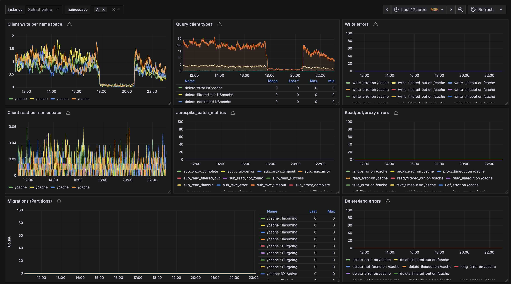

**Language / Язык:** [English](../../parsers/aerospike.md) | [Русский](aerospike.md)

# Aerospike

Alligator собирает метрики Aerospike через info-протокол Aerospike.

## Конфигурация

```
aggregate {
    aerospike tcp://localhost:3000;
}
```

Проверьте порт сервиса в конфигурационном файле. Сервис [обычно](https://aerospike.com/docs/server/operations/plan/network) слушает порт 3000.

## Экспортируемые метрики

| Metric | Type | Description |
|--------|------|-------------|
| `aerospike_*` | gauge | Статистика сервера из info-команды `statistics`. |
| `aerospike_status` | gauge | Статус узла из info-команды `status`. |
| `aerospike_*` with `namespace` label | gauge | Метрики по namespace из ответов info `namespace/{name}`. |
| `aerospike_client`, `aerospike_batch`, `aerospike_scan`, and other grouped families | gauge | Метрики namespace, сгруппированные по типу операции с дополнительной меткой `type`. |

Все экспортируемые семейства включают метаданные Prometheus `# HELP` и `# TYPE gauge`.

## Пример

Payload статистики:

```
statistics	uptime=100;cluster_size=3;
```

Payload namespace:

```
namespace/test	objects=42;client_read_success=5;
```

## Dashboard

Dashboard aerospike для Grafana + Prometheus доступен по следующей [ссылке](https://github.com/alligatormon/alligator/tree/master/dashboards/alligator-aerospike.json)


