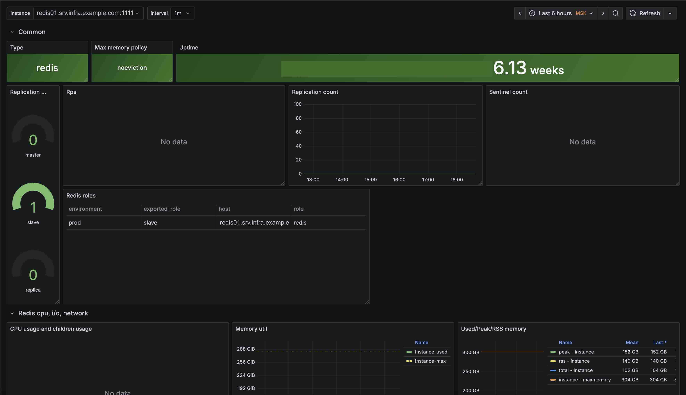

**Language / Язык:** [English](../../parsers/redis.md) | [Русский](redis.md)

## Redis

Redis может работать с паролем или через Unix-сокет. Alligator позволяет собирать метрики при любой из этих конфигураций. Следующий пример демонстрирует различные способы подключения к Redis:
```
aggregate {
    redis tcp://localhost:6379/;
    redis tcp://:pass@127.0.0.1:6379;
    redis unix:///tmp/redis.sock;
    redis unix://:pass@/tmp/redis.sock;
```

Мониторинг Sentinel следует аналогичному шаблону:
```
aggregate {
    sentinel tcp://localhost:26379;
    sentinel tcp://:password@localhost:26379;
}
```

Следующая конфигурация позволяет только выполнять ping-запрос для проверки доступности Redis. Её также можно использовать в контексте `query`.
```
aggregate {
    redis_ping tcp://localhost:6379 name=kv;
}

query {
    expr "MGET veigieMu ohThozoo ahPhouca";
    datasource kv;
    make redis_query;
}
```

## Dashboard
Системный дашборд для Grafana + Prometheus доступен по следующей [ссылке](https://github.com/alligatormon/alligator/tree/master/dashboards/alligator-redis.json)
<br>
