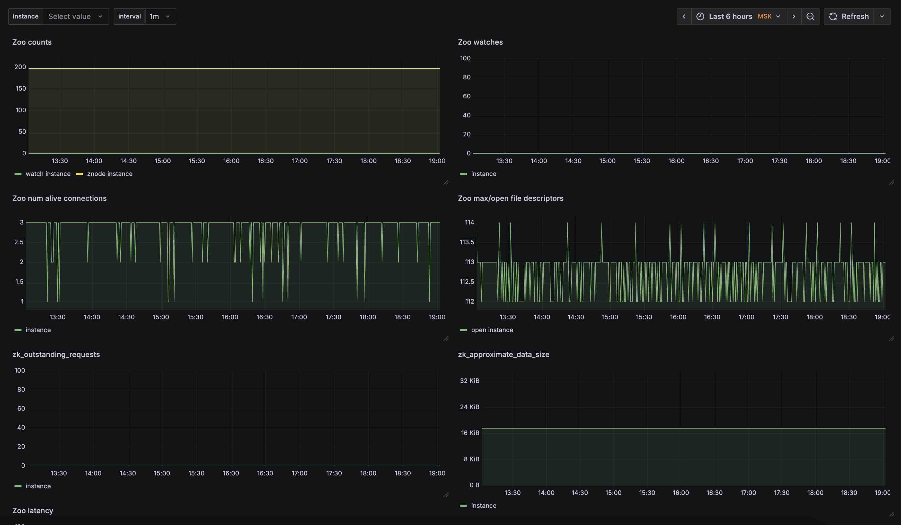

**Language / Язык:** [English](../../parsers/zookeeper.md) | [Русский](zookeeper.md)

# ZooKeeper

Alligator собирает метрики ZooKeeper с помощью four-letter words `mntr`, `isro` и `wchs`.

## Configuration

```
aggregate {
    zookeeper tcp://127.0.0.1:2181;
}
```

Также полезно проверять статистику процесса, запущенные сервисы и открытые порты:

```
system {
    process /zookeeper/;
    services zookeeper.service;
}

query {
	expr 'count by (src_port, process) (socket_stat{process="java", src_port="3888"})';
	make socket_match;
	datasource internal;
}

query {
	expr 'count by (src_port, process) (socket_stat{process="java", src_port="2181"})';
	make socket_match;
	datasource internal;
}

query {
	expr 'count by (src_port, process) (socket_stat{process="java", src_port="2888"})';
	make socket_match;
	datasource internal;
}
```

## Exported metrics

| Metric | Type | Source | Description |
|--------|------|--------|-------------|
| `zk_*` | gauge | `mntr` | Числовые поля из вывода `mntr`. |
| `zk_mode` | gauge | `mntr` | Роль узла: `standalone`, `follower` или `leader`. |
| `zk_readwrite` | gauge | `isro` | Режим чтения/записи: `ro`, `rw` или `null`. |
| `zk_total_watches` | gauge | `wchs` | Общее число watches. |

Все экспортируемые семейства включают метаданные Prometheus `# HELP` и `# TYPE gauge`.

## Example

Фрагмент `mntr`:

```
zk_avg_latency	10
zk_server_state	leader
```

Ответ `isro`:

```
rw
```

Фрагмент `wchs`:

```
Total watches:15
```

## Dashboard

Системный дашборд для Grafana + Prometheus доступен по следующей [ссылке](https://github.com/alligatormon/alligator/tree/master/dashboards/alligator-zookeeper.json)

<br>
