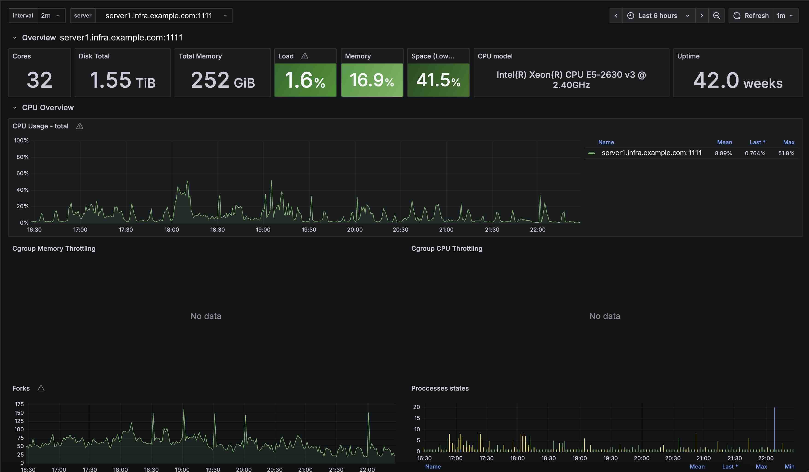
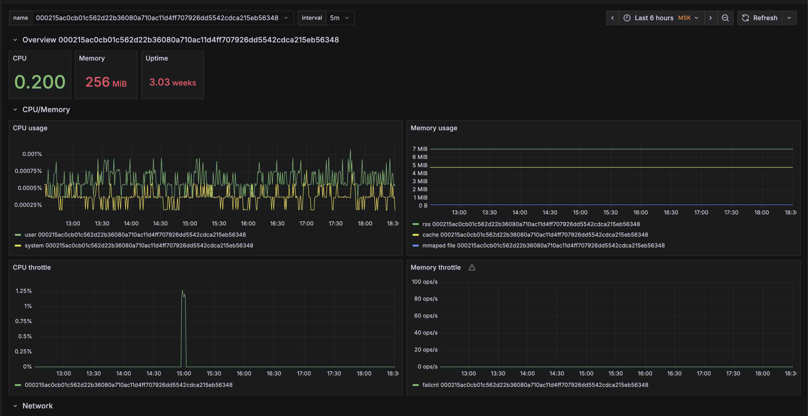

**Language / Язык:** [English](../system.md) | [Русский](system.md)

# System block

## Overview
Alligator поддерживает system-wide метрики ОС, железа и виртуальных машин.

Краткий обзор всех опций в этом context:
```
system {
    base;
    disk;
    network;
    process [nginx] [bash] [/[bash]*/];
    services [nginx.service];
    services_process [php-fpm.service];
    services_checking_users [system] [user] [login1] [login2];
    smart;
    ipmi;
    nvml;
    dcgm;
    amdgpu;
    macos_gpu;
    firewall [ipset=[entries|on]];
    cpuavg period=5;
    packages [nginx] [alligator];
    cadvisor [option1] [option2] .. [optionN];

    pidfile /path/to/pidfile1 [/path/to/pidfile2] ... [/path/to/pidfileN];
    userprocess user1 [user2] ... [userN];
    groupprocess user1 [group2] ... [groupN];
    cgroup /cgroup1/ /[cgroup2]/ ... /[cgroupN]/;

    sysfs  /path/to/dir;
    procfs /path/to/dir;
    rundir /path/to/dir;
    usrdir /path/to/dir;
    etcdir /path/to/dir;
    log_level off;
}
```

## base
Включает мониторинг базовых ресурсов ОС и железа, включая CPU, память и температуры материнской платы и компонентов. Также включаются ресурсы ОС: loadavg, openfiles, interrupts и context switches.

Заметки по именованию метрик:

- Метрика uptime хоста — `system_uptime_seconds`.
- Семейства IPMI-метрик экспортируются в lowercase snake_case (`ipmi_*`) для согласованности с Prometheus naming.
- `interface_address` пропускает интерфейсы, чьё имя начинается с `veth` (тот же 4-символьный префикс, что у `if_stat` / `link_status`). Это снижает churn series Docker container veth. `iface_num` по-прежнему считает все интерфейсы, возвращаемые ОС.


## disk
Включает мониторинг disk-метрик, включая статистику файловых систем и I/O блочных устройств.


## network
Включает мониторинг сетевых интерфейсов и статистики сокетов.

`if_stat`, `if_speed` и `link_status` пропускают интерфейсы, чьё имя начинается с `veth` (эфемерные пары Docker/LXC). Тот же skip по префиксу применяется к `interface_address` из `base`. Другие имена, случайно начинающиеся с `veth` (например `vethernet`), тоже пропускаются.


## process
Задаёт список процессов для проверки запущенности и сбора данных об использовании ресурсов в терминах ulimits.\
Если процессы не указаны, Alligator собирает ulimits usage для всех процессов.\
Включает метрики использования памяти, CPU, disk I/O, open files, threads и vmaps.


## services
Собирает service-level метрики для Linux systemd units.\
Проверяет, запущен ли сервис и включён ли он, и отдаёт счётчики task'ов сервиса.


## services_process
Расширенный режим scrape для Linux systemd units.\
Включает все метрики из `services` и дополнительно scrape'ит process-level метрики из cgroup сервиса.

Используйте этот режим только там, где нужно (для выбранных сервисов), потому что на сильно форкающихся сервисах может генерироваться большой объём process metrics.

Примечание: исторически `services` также включал process scraping. Это поведение перенесено в `services_process`.


## services_checking_users
Ограничивает **какие systemd scopes** обходит Alligator при сборе метрик `services` / `services_process` (`service_enabled`, `service_running`, `service_tasks_count`, `service_match`).\
Когда этот список **непустой**, сканируются только перечисленные scopes; когда **пустой или не задан**, поведение без изменений (все обычные места, включая каждый активный login под `/run/user/*`).

Записи — string tokens:

- **`system`** — каталоги system units (`/usr/lib/systemd/system/`, generator trees под `/run/systemd/`, и т.д.). Метрики для этих units используют label `username="system"`.
- **`user`** — общие user-unit trees (`/usr/lib/systemd/user/`, `/etc/systemd/user/`, …). Метрики используют label `username="user"`.
- **Любой другой token** — трактуется как **login name** (`getpwnam`). Alligator сканирует units этого пользователя под `/run/user/<uid>/systemd/user/` и `$HOME/.config/systemd/user/`. Метрики используют `username="<login>"`.

Plain config перечисляет tokens после operator, как другие system arrays:

```
system {
    services_process [httpd.service];
    services_checking_users [nobody] [system];
}
```

JSON (API или `.json` config) использует array под `system.services_checking_users`:

```json
"system": {
  "services_process": ["httpd.service"],
  "services_checking_users": ["nobody", "system"]
}
```

При каждом обычном apply конфигурации список **полностью заменяется** (не merge incrementally с устаревшими users).

**Совет:** сочетайте `services_checking_users` с `services` / `services_process`, чтобы внутри уменьшенного scan set совпадали только нужные units.


## smart
Включает сбор S.M.A.R.T. метрик.


## ipmi
Включает сбор IPMI-метрик нативными вызовами ioctl(). Для интеграции с ipmitool см. [документацию](https://github.com/alligatormon/alligator/blob/master/doc/parsers/ipmi.md)


## nvml
Собирает метрики NVIDIA GPU in-process через **NVML** (`libnvidia-ml.so`), без DCGM и `dcgm-exporter`. Только Linux.

Нужен явный путь к библиотеке в top-level блоке `modules` (как у `rpmlib` / `libvirt`). Автопоиск soname не выполняется.

```
modules {
    nvml /usr/lib64/libnvidia-ml.so.1;
}

system {
    nvml;
}
```

JSON / API:

```json
{
  "modules": { "nvml": "/usr/lib64/libnvidia-ml.so.1" },
  "system": { "nvml": {} }
}
```

Если `modules.nvml` отсутствует или библиотека не загружается/не инициализируется, scrape пропускается (с логом). **Автоматического** fallback на `nvidia-smi` нет; для CLI-пути используйте [парсер nvidia_smi](parsers/nvidia-smi.md).

Оба коллектора можно включать вместе: префиксы разные (`nvml_*` vs `nvidia_smi_*`).

Scrape идёт в libuv worker thread, чтобы вызовы NVML не блокировали event loop.

### Метрики

Префикс `nvml_`. Labels на per-GPU series: `name`, `uuid`, `serial`, `index`. Суффиксы единиц: `_bytes`, `_percent`, `_watt`, `_mhz`, `_celsius`, `_joules`.

| Метрика | Заметки |
|---------|---------|
| `nvml_gpu_count` | Число видимых GPU |
| `nvml_driver_version{version=…}` | Значение `1` |
| `nvml_device_info{…,pci_bus_id,brand}` | Значение `1` |
| `nvml_utilization_{gpu,memory,encoder,decoder}_percent` | |
| `nvml_memory_{free,used,total}_bytes` | Framebuffer |
| `nvml_temperature_{gpu,memory}_celsius` | Memory temp, если поддерживается |
| `nvml_power_usage_watt`, `nvml_power_limit{,_min,_max}_watt` | mW → W |
| `nvml_energy_consumption_joules` | Накопительно с загрузки драйвера |
| `nvml_clocks_{sm,memory,graphics,video}_mhz` | |
| `nvml_fan_speed_percent` | |
| `nvml_pcie_{tx,rx}_bytes` | Gauge последнего sample interval (KB/s → B/s) |
| `nvml_pcie_replay_total` | |
| `nvml_ecc_{corrected,uncorrected}_total` | Volatile aggregate |
| `nvml_retired_pages_{sbe,dbe}_total` | |
| `nvml_clocks_throttle_reasons` | Bitmask + boolean gauges idle / sw_power / hw_thermal / hw_power_brake |
| `nvml_mig_mode`, `nvml_persistence_mode` | `0`/`1` |
| `nvml_pstate{pstate=P0}` | Значение `1` |
| `nvml_process_used_memory_bytes{pid,process_name,type}` | `type=compute\|graphics` при поддержке |

### Соответствие полям dcgm-exporter

| Метрика Alligator | Типичное поле DCGM |
|-------------------|--------------------|
| `nvml_clocks_sm_mhz` / `nvml_clocks_memory_mhz` | `DCGM_FI_DEV_SM_CLOCK` / `MEM_CLOCK` |
| `nvml_temperature_gpu_celsius` | `DCGM_FI_DEV_GPU_TEMP` |
| `nvml_power_usage_watt` | `DCGM_FI_DEV_POWER_USAGE` |
| `nvml_energy_consumption_joules` | `DCGM_FI_DEV_TOTAL_ENERGY_CONSUMPTION` |
| `nvml_utilization_gpu_percent` | `DCGM_FI_DEV_GPU_UTIL` |
| `nvml_utilization_memory_percent` | `DCGM_FI_DEV_MEM_COPY_UTIL` |
| `nvml_memory_used_bytes` / `nvml_memory_free_bytes` | `DCGM_FI_DEV_FB_USED` / `FB_FREE` |
| `nvml_fan_speed_percent` | `DCGM_FI_DEV_FAN_SPEED` |

### Ограничения относительно DCGM

- **`DCGM_FI_PROF_*`** (SM occupancy, tensor pipe, DRAM active и т.п.) собираются через [`system { dcgm; }`](#dcgm), не через NVML.
- **XID errors** в NVML event-based; в этом коллекторе пока не экспортируются.


## dcgm
Собирает NVIDIA **profiling**-метрики in-process через embedded **DCGM** (`libdcgm.so`), без `dcgm-exporter`. Дополняет [nvml](#nvml) (health/capacity). Только Linux; обычно нужны datacenter GPU и пакеты DCGM.

Нужен явный путь к библиотеке (без auto-search soname):

```
modules {
    nvml /usr/lib64/libnvidia-ml.so.1;
    dcgm /usr/lib64/libdcgm.so.4;
}

system {
    nvml;
    dcgm;
}
```

JSON / API:

```json
{
  "modules": {
    "nvml": "/usr/lib64/libnvidia-ml.so.1",
    "dcgm": "/usr/lib64/libdcgm.so.4"
  },
  "system": { "nvml": {}, "dcgm": {} }
}
```

Alligator поднимает **embedded** DCGM host engine в manual mode, всегда watch'ит identity fields и пробует каждый PROF field отдельной watch group (~1s). Смешанные PROF groups на V100 не проходят (несовместимые counters); неподдерживаемые fields пропускаются.

Не стоит одновременно крутить alligator-embedded DCGM и `dcgm-exporter` на одних и тех же GPU без настройки — лучше один sampler.

Неподдерживаемые отдельные fields на конкретной GPU пропускаются, как у NVML.

### Установка на хосте

**1. Драйвер NVIDIA** — тот же стек, что для CUDA/GPU. NVML идёт из драйвера (`libnvidia-ml.so.1`). DCGM — **отдельный** пакет.

**2. Datacenter GPU Manager** — ставится пакет с `libdcgm.so` и profiling plugin (из исходников DCGM profiling module не собрать):

| Дистрибутив | Пакет | Путь к библиотеке (проверить на хосте) |
|-------------|-------|----------------------------------------|
| RHEL / Rocky / Alma | `datacenter-gpu-manager` | `/usr/lib64/libdcgm.so.3` или `.so.4` |
| Ubuntu / Debian | `datacenter-gpu-manager` | `/usr/lib/x86_64-linux-gnu/libdcgm.so.*` |

```bash
dnf install datacenter-gpu-manager    # RHEL
# apt install datacenter-gpu-manager  # Ubuntu
ls /usr/lib64/libdcgm.so*             # или путь из таблицы
```

В `modules.dcgm` укажите **реальный soname** на хосте. Auto-search по `LD_LIBRARY_PATH` нет.

**3. Embedded mode** — alligator вызывает `dcgmStartEmbedded`; отдельный `nv-hostengine` и `dcgm-exporter` **не нужны**.

**4. GPU**

| Класс | Ожидание |
|-------|----------|
| Tesla / datacenter (V100, A100, …) | `dcgm_profiling_available 1`, SM/DRAM/PCIe ratios |
| GeForce RTX 20/30/40 | identity + `dcgm_profiling_available 0` |
| PCIe без NVLink | `dcgm_nvlink_*` нулевые или отсутствуют |

Fields **1013–1015** — Ampere+; на V100 `Feature not supported`, нормально иметь 12/15 watches.

**5. Права** — profiling часто требует **root** или `CAP_SYS_ADMIN`. На Tesla при `dcgm_profiling_available 0` сначала проверьте права.

**6. Конфликты** — Nsight / standalone hostengine / dcgm-exporter на тех же GPU.

**7. Проверка**

```bash
dcgmi modules -l
curl -s localhost:1111 | grep dcgm_profiling_available
# в логах: dcgm: profiling watches enabled (N/15 fields)
```

После смены config — reload alligator.

### Метрики

Префикс `dcgm_`. Labels на per-GPU series: `name`, `uuid`, `serial`, `index`. Profiling ratios — 0.0–1.0 (не проценты).

| Метрика | Поле DCGM |
|---------|-----------|
| `dcgm_gpu_count` | число supported GPU |
| `dcgm_profiling_available` | `1` если PROF watches активны, иначе `0` |
| `dcgm_device_info{…,pci_bus_id}` | identity |
| `dcgm_gr_engine_active_ratio` | `DCGM_FI_PROF_GR_ENGINE_ACTIVE` (1001) |
| `dcgm_sm_active_ratio` | `DCGM_FI_PROF_SM_ACTIVE` (1002) |
| `dcgm_sm_occupancy_ratio` | `DCGM_FI_PROF_SM_OCCUPANCY` (1003) |
| `dcgm_tensor_active_ratio` | `DCGM_FI_PROF_PIPE_TENSOR_ACTIVE` (1004) |
| `dcgm_dram_active_ratio` | `DCGM_FI_PROF_DRAM_ACTIVE` (1005) |
| `dcgm_fp64_active_ratio` / `fp32` / `fp16` | 1006–1008 |
| `dcgm_pcie_{tx,rx}_bytes` | 1009–1010 |
| `dcgm_nvlink_{tx,rx}_bytes` | 1011–1012 |
| `dcgm_tensor_{imma,hmma,dfma}_active_ratio` | 1013–1015 |

### Заметки

- Пакет: **`datacenter-gpu-manager`** (см. [Установка на хосте](#установка-на-хосте)).
- Profiling даёт overhead; набор fields небольшой.
- VRAM/power/temp — `nvml`; SM/tensor/DRAM activity — `dcgm`, когда доступен.


## amdgpu
Собирает метрики AMD GPU из **amdgpu sysfs** (`/sys/class/drm/cardN/device/`), без ROCm SMI и vendor-библиотеки. Linux с драйвером `amdgpu` (Radeon и Instinct). Путь в `modules { }` не нужен.

```
system {
    amdgpu;
}
```

JSON / API:

```json
{ "system": { "amdgpu": {} } }
```

Обходит `$sysfs/class/drm/card[0-9]+` и оставляет устройства с PCI `vendor` `0x1002` или драйвером `amdgpu`. Узлы `renderD*` и коннекторы пропускаются. Отсутствующие sysfs-файлы опускаются (как в NVML). Бинарный blob `gpu_metrics` не разбирается.

`base` уже может отдавать hwmon-сенсоры amdgpu как `core_temperature_celsius`; семейство `amdgpu_*` — отдельный GPU-набор (utilization, VRAM, clocks, power).

### Метрики

Префикс `amdgpu_`. Labels на per-GPU series: `name`, `index`, `pci`, `unique_id`. Суффиксы единиц: `_bytes`, `_percent`, `_watt`, `_mhz`, `_celsius`, `_rpm`.

| Метрика | Источник |
|---------|----------|
| `amdgpu_gpu_count` | Число видимых AMD GPU |
| `amdgpu_device_info{…,vbios}` | `product_name` / PCI id, `vbios_version` |
| `amdgpu_utilization_{gpu,memory}_percent` | `gpu_busy_percent`, `mem_busy_percent` |
| `amdgpu_memory_vram_{total,used,free}_bytes` | `mem_info_vram_*` |
| `amdgpu_memory_gtt_{total,used}_bytes` | `mem_info_gtt_*` |
| `amdgpu_memory_visible_vram_{total,used}_bytes` | `mem_info_vis_vram_*` |
| `amdgpu_clocks_{sclk,mclk}_mhz` | `pp_dpm_sclk` / `pp_dpm_mclk` (текущая строка `*`), иначе hwmon `freq*_input` |
| `amdgpu_temperature_celsius{sensor=edge\|junction\|mem}` | Device hwmon `temp*_input` (миллиградусы) |
| `amdgpu_power_{average,cap}_watt` | `power1_average` / `power1_cap` (µW → W) |
| `amdgpu_fan_speed_rpm` | `fan1_input` |


## macos_gpu
Собирает метрики GPU macOS через публичные свойства **IOKit IOAccelerator**. Только Darwin. Apple Silicon (AGX) и Intel iGPU / AMD dGPU на Intel Mac, если те же ключи есть. Дополнительный путь к фреймворку не нужен; IOKit уже линкуется.

```
system {
    macos_gpu;
}
```

JSON / API:

```json
{ "system": { "macos_gpu": {} } }
```

Читает `PerformanceStatistics` (utilization, unified memory) плюс `model`, `IOClass`, `IONameMatched`, `gpu-core-count`. Приватные каналы IOReport (энергия, частота, температура GPU) не используются.

### Метрики

Префикс `macos_gpu_`. Labels на per-GPU series: `name`, `class`, `index`.

| Метрика | Заметки |
|---------|---------|
| `macos_gpu_gpu_count` | Число IOAccelerator |
| `macos_gpu_device_info{…,compat}` | `compat` — `IONameMatched` (например `gpu,t6040`) |
| `macos_gpu_utilization_{device,renderer,tiler}_percent` | Из `PerformanceStatistics` |
| `macos_gpu_memory_{alloc,in_use,in_use_driver}_bytes` | Unified/system memory (UMA на Apple Silicon) |
| `macos_gpu_memory_device_{alloc,in_use}_bytes` | Выделенная VRAM, если есть (дискретные GPU) |
| `macos_gpu_core_count` | `gpu-core-count` |
| `macos_gpu_recovery_count` | `recoveryCount` |


## firewall
Включает получение счётчиков firewall.
Дополнительный параметр 'ipset' позволяет scrape списка sets. Если указана опция 'entries', Alligator scrape'ит entries внутри ipset.


## cpuavg
Создаёт аналог loadavg в Linux только на основе использования CPU.\
Имеет одну опцию 'period', задающую период усреднения в минутах.\
Например, собранная метрика выглядит так:
```
cpu_usage_average_percent 4.326667
```


## packages
Собирает информацию об установленных в ОС пакетах системным installer'ом и дате установки.\
Можно указать список пакетов. Иначе собирается информация по всем пакетам в системе.

Alligator экспортирует:

- `package_installed` — labels `name`, `version`, `release`, `arch`; значение — время установки (Unix timestamp)
- `package_total` — общее число установленных пакетов, увиденных при scrape
- `rpmdb_load_failed` — `1`, когда данные пакетов не удалось загрузить, `0` иначе (только на RPM-based хостах)

`arch` заполняется на Debian/Ubuntu, где один и тот же пакет может быть установлен сразу для
нескольких архитектур; на остальных backend'ах метка пустая.

Пример метрики:

```
# HELP package_installed Unix timestamp when the package was installed, labeled by name, version, release and arch.
# TYPE package_installed gauge
package_installed {version="6.40", name="nmap-ncat", release="7.el7", arch=""} 1527797852
package_installed {version="1.31.3-0.2.5-1.0.4", name="nginx", release="0.4.1", arch="amd64"} 1
# HELP package_total Total number of installed packages seen during the last scrape.
# TYPE package_total gauge
package_total 842
# HELP rpmdb_load_failed 1 if the RPM package database could not be loaded during the last scrape, 0 otherwise.
# TYPE rpmdb_load_failed gauge
rpmdb_load_failed 0
```

Prometheus exposition включает строки `# HELP` и `# TYPE` для каждого metric family. Без явной регистрации `package_installed` появился бы как `# TYPE package_installed unknown` с повторением имени метрики в help text.

### RPM data source

На Linux метрики RPM-пакетов собираются одним из двух способов:

| Source | When used |
|--------|-----------|
| **rpmlib** | Настроен `modules { rpmlib <path>; }` с путём к `librpm` (например `/usr/lib64/librpm.so.9`) |
| **rpm -qa** | По умолчанию, когда `rpmlib` не настроен, или при сбое загрузки/использования библиотеки |

Автоматический поиск soname `librpm.so.*` не выполняется. Путь к библиотеке нужно задать явно, если нужен backend `rpmlib`.

Путь `rpmlib` читается из top-level блока `modules` (ключ `rpmlib`), тот же механизм, что для других dynamic libraries:

```
modules {
    rpmlib /usr/lib64/librpm.so.9;
}

system {
    packages [nginx] [alligator];
}
```

JSON / API configuration:

```json
"modules": {
  "rpmlib": "/usr/lib64/librpm.so.9"
},
"system": {
  "packages": ["nginx", "alligator"]
}
```

Когда `rpmlib` настроен, Alligator асинхронно загружает библиотеку в libuv worker thread (`uv_dlopen` / `uv_dlsym`), читает RPM database через librpm API и публикует метрики на event loop. Это не блокирует main client loop при доступе к базе.

Если `rpmlib` отсутствует, не открывается, нет нужных symbols, или iteration fails, Alligator fallback'ит на:

```
rpm -qa --queryformat '%{RPMTAG_INSTALLTIME} %{NAME} %{VERSION} %{RELEASE}\n'
```

Этот fallback совпадает с поведением на старых системах (например CentOS 7 с Berkeley DB rpmdb), где прямой доступ к librpm может быть недоступен или нежелателен.

### Logging

Выбор datasource логируется через system context logger (`carglog` на `system_carg`) на уровне **info**, когда `system.log_level` (или глобальный `log_level`) — `info` или подробнее. Типичные сообщения:

- `rpm packages datasource: rpm -qa (modules.rpmlib is not configured)` — нет модуля `rpmlib`; используется command backend
- `rpm packages datasource: rpmlib, loading library <path>` — worker запущен для настроенной библиотеки
- `rpm packages datasource: rpmlib (library: <path>)` — сбор успешен через librpm
- `rpm packages datasource: rpmlib failed, fallback to rpm -qa (library: <path>, reason: <...>)` — librpm failed; использован command fallback

Reason strings включают детали вроде ошибок `dlopen`, missing symbols или пустых iterator results.

### Источник данных на Debian/Ubuntu

На Debian/Ubuntu метрики пакетов собираются из `/var/lib/dpkg/status`, учитываются только станзы со
`Status: install ok installed` (или `hold ok installed`). `/var/lib/dpkg/available` не используется: это
легаси-кэш *доступных* в репозиториях пакетов, APT его больше не обновляет, и об установленных пакетах он
ничего не говорит. Модуль `rpmlib` применяется только на RPM-based хостах.

dpkg не хранит время установки пакета, поэтому на Debian/Ubuntu значение `package_installed` всегда
равно `1`, информацию несёт только набор меток. Иногда вместо него берут mtime файла
`/var/lib/dpkg/info/<пакет>.list`, но он перезаписывается при апгрейде и одинаков для всех пакетов на
хосте, развёрнутом из образа, поэтому здесь он не экспортируется.

## cadvisor
Реализует метрики из известного exporter'а CAdvisor.\

Пример использования в конфигурационном файле:
```
system {
    cadvisor [docker=http://unix:/var/run/docker.sock:/containers/json] [log_level=info] [add_labels=collector:cadvisor];
}
```

### log\_level
Задаёт уровень логирования для этого context. Единицы для этой опции описаны в [документе](https://github.com/alligatormon/alligator/blob/master/doc/configuration.md#available-log-levels)

### add\_label
Эта опция даёт возможность добавлять extra labels.

Например, эта конфигурация добавляет два extra label для каждой метрики:
```
system {
    cadvisor add_label=label1:value1 add_label=label2:value2;
}
```

### docker
Задаёт socket docker daemon. По умолчанию `http://unix:/var/run/docker.sock:/containers/json`.


## pidfile, userprocess, groupprocess, cgroup
Задаёт проверку процессов по pidfile, user, group или cgroup.

Пример использования в конфигурационном файле:
```
system {
    pidfile /var/run/nginx.pid;
    userprocess nginx;
    groupprocess nobody;
    cgroup /cpu/;
}
```

## sysfs, procfs, rundir, usrdir, etcdir
Позволяет переопределить control directories ОС по умолчанию — полезно для тестирования и custom-built систем.


## log_level
По умолчанию: off\
Множественное: нет\
Задаёт уровень логирования для этого context. Единицы для этой опции описаны в [документе](https://github.com/alligatormon/alligator/blob/master/doc/configuration.md#available-log-levels)

```
system {
    base;
    log_level debug;
}
```


# Dashboard
System dashboard для Grafana + Prometheus доступен по [ссылке](https://github.com/alligatormon/alligator/tree/master/dashboards/alligator-system.json)
<br>

Кроме того, dashboard cAdvisor (docker, containerd, podman, LXC, systemd-nspawn) доступен по [ссылке](https://github.com/alligatormon/alligator/tree/master/dashboards/alligator-cadvisor.json)
<br>

Также dashboard firewall доступен по [ссылке](https://github.com/alligatormon/alligator/tree/master/dashboards/alligator-firewall.json)
